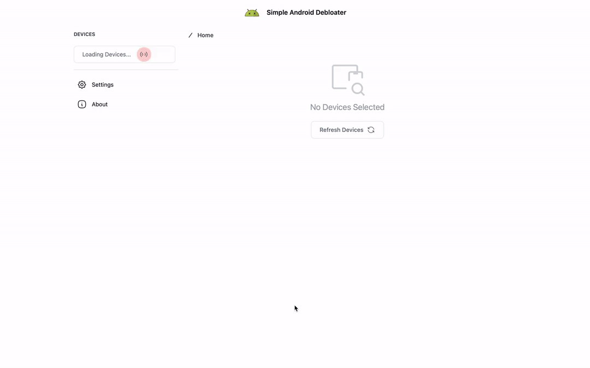

# Simple Android Debloater

This software is in beta 🚧

Simpl Android Debloater is a free and open source project to disable unwanted system apps that careers / OEMs force install in our mobile phones.

This is an attempt like [Universal Android Debloater](https://github.com/0x192/universal-android-debloater/) built with [Tauri](https://tauri.app/) and [Sveltekit](https://kit.svelte.dev/). 

Unlike UAD, this tool is aimed to be beginner friendly so as to not uninstall apps unexpectedly which can brick the device.

**Note**: *Disabling system apps can also soft brick the device*

 ## Download

 Goto the latest [Releases Page](https://github.com/thulasi-ram/simple_android_debloater/releases) click on assets and download the installers applicable for your OS. 

 Supported Platforms: 
- Windows: Installer (setup.exe, .msi), 
- Mac: Installer (.dmg), App (.app) 
- Linux: Installer (.deb), Image (.AppImage)

Screenshots are available in [static](./static/screenshots) directory.

## Usage

### Prerequisites
- In the phone
    - Make sure Usb Debugging is turned on
    - This requires one to enable developer options
- In the PC
    - Make sure to download [ADB Tools](https://developer.android.com/tools/releases/platform-tools#downloads) for your PC.

[Read More from XDA On Setting up USB Debugging and ABD](https://www.xda-developers.com/install-adb-windows-macos-linux/)

### Usage

- Click on Devices found in the left sidebar
- Use the search bar for searching
- Filtering for system, thirdparty, disabled, enabled app states
- Packages that are disabled by DPM (Device Policy Manager) are hidden

## Development

Frontend Server Only:
`npm run dev`

Run rust and node at once:
`npm run tauri dev -- --verbose`

[Tauri Quickstart Docs](https://tauri.app/v1/guides/getting-started/setup/sveltekit)

### Logs
| Platform | Location                               | Example                                              |
|----------|----------------------------------------|------------------------------------------------------|
| macOS    | $HOME/Library/Logs/{bundleIdentifier}  | /Users/Bob/Library/Logs/com.ahiravan.simple-android-debloater           |
| Windows  | %APPDATA%\${bundleIdentifier}\logs     | C:\Users\Bob\AppData\Roaming\com.ahiravan.simple-android-debloater\logs |
| Linux    | $HOME/.config/${bundleIdentifier}/logs | /home/bob/.config/com.ahiravan.simple-android-debloater/logs            |

 ## TODOs:

- [x] List Devices

- [x] List Packages

- [x] Hashset Packages

- [x] Validate deviceID, userID, packageGetAll are valid

- [x] Flowbite modal to open up if validation fails

- [x] Disable packages

- [x] Adb track device

- [ ] Github discussion for package

- [x] ~Prepackage ADB~ Custom ADB Path Instead

- [x] Persist Settings